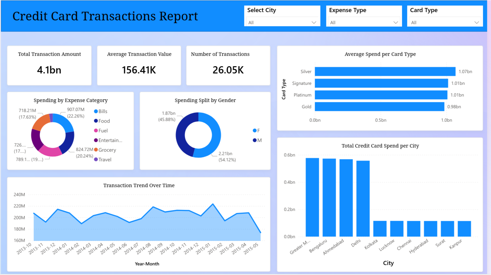

# Credit Card Transactions Report

## Project Overview

This project is a Power BI dashboard designed to help a bank understand customer credit card spending behavior. It visualizes spending patterns, highlights trends, and provides insights into how customers use their credit cards, enabling data-driven decision-making.
## Features

* Visualizes total spending by category, time, and cardtype, gender.
* Provides interactive charts for detailed exploration.
* Summarizes key metrics for quick insights.

## Tools & Technologies

* **Power BI**: Data visualization and reporting
* **Data Analysis**: Cleaning and aggregating transaction data
* **Visualization**: Interactive charts and graphs

## Insights
* Provides the bank with a clear understanding of customer spending trends.
* Helps identify opportunities for personalized offers and promotions.

## Overview
The full PowerPoint presentation of the Credit Card Transactions Insights Report can be viewed 

